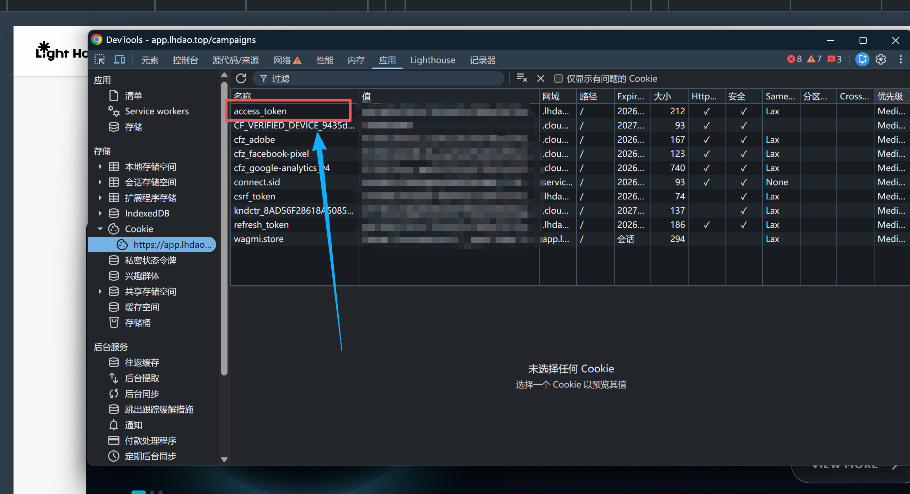

# Lighthouse Monitor

监控 [Lighthouse (lhdao)](https://app.lhdao.top/campaigns) 平台新任务，自动占位并推送到企业微信。

## 功能

- 轮询 Lighthouse 平台的推文任务和互动任务
- 推文任务：自动抢位，不受奖励阈值限制
- 互动任务：实际到手奖励 >= 阈值时自动占位，低于阈值的静默跳过
- 占位成功单独推送企业微信，附带任务链接
- 已通知任务自动去重，不会重复推送
- Token 过期前 24 小时自动推送企业微信提醒
- `MIN_REWARD_LUX` 和 `AUTO_GRAB` 改 `.env` 即时生效，无需重启

## 快速开始

1. 复制配置文件

```bash
cp .env.example .env
```

2. 获取 Access Token（见下方教程）

3. 编辑 `.env`，填入 token 和企业微信 webhook

4. 运行

```bash
node monitor.js
```

> 需要 Node.js 18+（使用了全局 fetch）

## 服务器部署

```bash
# 上传到服务器
scp -r lighthouse-monitor/ user@server:~/

# 后台运行
nohup node ~/lighthouse-monitor/monitor.js > ~/lighthouse-monitor/monitor.log 2>&1 &

# 查看日志
tail -f ~/lighthouse-monitor/monitor.log

# 停止
kill $(pgrep -f monitor.js)
```

换 Token 或改阈值时直接编辑服务器上的 `.env`，下次轮询自动生效，不用重启。

## 配置项

| 变量 | 说明 | 默认值 |
|------|------|--------|
| `LH_GRAPHQL_URL` | Lighthouse GraphQL API | `https://service.lhdao.top/graphql` |
| `LH_ACCESS_TOKEN` | 登录 token（见下方获取方式） | - |
| `WECHAT_WEBHOOK_URL` | 企业微信机器人 webhook | - |
| `POLL_INTERVAL_MS` | 轮询间隔（毫秒） | `60000` |
| `AUTO_GRAB` | 是否自动占位 | `true` |
| `MIN_REWARD_LUX` | 互动任务最低奖励阈值（LUX），运行中可改 | `0.5` |

## 获取 Access Token

1. 浏览器登录 https://app.lhdao.top
2. 按 `F12` 打开 DevTools
3. 切换到「应用」(Application) 标签
4. 左侧展开「存储 → Cookie → https://app.lhdao...」
5. 找到 `access_token`，复制其「值」列的内容



将复制的值填入 `.env` 的 `LH_ACCESS_TOKEN=` 后面即可。

> Token 有效期约 7 天，过期前 24 小时会自动推送企业微信提醒。

## 续期 Token

收到过期提醒后：

1. 浏览器重新登录 https://app.lhdao.top（Twitter 授权）
2. 按上面的步骤重新复制 `access_token` 的值
3. 编辑服务器上的 `.env`，替换 `LH_ACCESS_TOKEN=` 后面的值
4. 无需重启，下次轮询自动使用新 token

## 工作原理

脚本通过 Lighthouse 的 GraphQL API 实现监控和占位。

核心流程：`setInterval` 定时轮询 → `fetch` 调 GraphQL 查询新任务 → 符合条件的调 GraphQL mutation 占位 → `fetch` 推送企业微信

关键技术点：

- `fetch` — Node.js 18+ 内置的 HTTP 客户端，用来发 GraphQL 请求和企业微信 webhook
- GraphQL query — 查询任务列表，相当于你在网页上看到的 campaigns 页面数据
- GraphQL mutation — 执行占位操作，相当于你在网页上点「抢位」按钮
- `setInterval(poll, 60000)` — 每 60 秒执行一次 poll 函数
- `async/await` — 处理异步请求，等 API 返回结果后再继续下一步
- `JSON.parse(Buffer.from(token.split('.')[1], 'base64'))` — 解析 JWT token 里的过期时间，用于过期提醒
